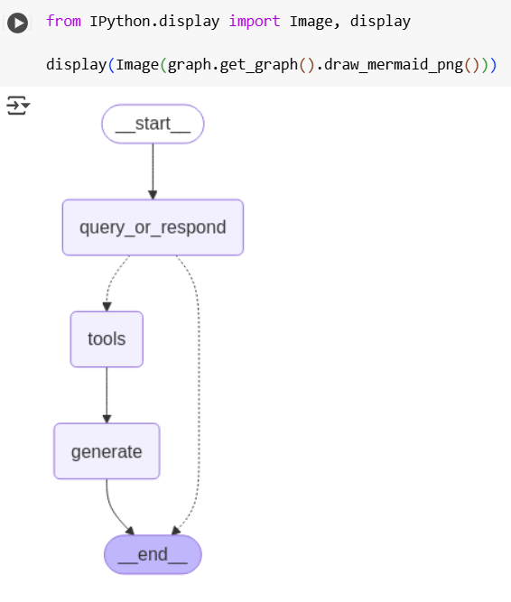

# Build a Retrieval Augmented Generation (RAG) App Part 1 and Part 2

Este repositorio contiene implementaciones de dos tutoriales de LangChain:
1. **Generación Aumentada por Recuperación (RAG)**: Un tutorial sobre cómo construir una pipeline de generación aumentada por recuperación utilizando LangChain.
2. **Respuesta a Preguntas con Historial de Chat**: Un tutorial sobre cómo implementar un sistema de respuesta a preguntas que incorpora el historial de chat para proporcionar contexto.

Ambos tutoriales demuestran cómo usar LangChain para construir aplicaciones potentes basadas en modelos de lenguaje.

---

## Arquitectura y Componentes del Proyecto

### 1. Generación Aumentada por Recuperación (RAG)
La pipeline de RAG consta de los siguientes componentes:
- **Cargador de Documentos**: Carga documentos desde una fuente específica (por ejemplo, archivos PDF o de texto).
- **Divisor de Texto**: Divide los documentos en fragmentos más pequeños para su procesamiento.
- **Embeddings**: Convierte los fragmentos de texto en representaciones vectoriales utilizando un modelo de embeddings preentrenado.
- **Almacén de Vectores**: Almacena los embeddings para una recuperación eficiente.
- **Recuperador**: Recupera fragmentos de documentos relevantes basados en una consulta.
- **Modelo de Lenguaje**: Genera respuestas utilizando el contexto recuperado.

### 2. Respuesta a Preguntas con Historial de Chat
El sistema de respuesta a preguntas con historial de chat incluye:
- **Memoria de Chat**: Almacena el historial de interacciones entre el usuario y el sistema.
- **Modelo de Lenguaje**: Procesa la consulta del usuario junto con el historial de chat para generar respuestas conscientes del contexto.
- **Plantilla de Prompt**: Define la estructura de la entrada al modelo de lenguaje, incorporando el historial de chat.

---

## Instalación y Configuración

Sigue estos pasos para configurar y ejecutar el código:

### Requisitos Previos
- Python 3.8 o superior
- OpenAI API key.
- Pinecone API key.

  

###  Clona el Repositorio
```bash
git clone https://github.com/tu-usuario/langchain-tutorials.git
```

### Dependencias

1) **Instalar Librerías Requeridas**

    Instalar LangChain y dependencias necesarias

   ```bash
   %pip install --quiet --upgrade langchain-text-splitters langchain-community langgraph
   !pip install langchain-openai
   pip install -qU langchain-openai
   pip install -qU langchain-pinecone
   pip install -qU langchain-pinecone pinecone-notebooks
   ```

### **PARTE 1**

2) **Configuración de keys**

   Configuramos las claves API de OpenAI y Pinecone. La key de OpneAI fue dada por el profesor.

   **Clave API de OpenAI:**
   ```python
   import getpass
   import os

   if not os.environ.get("OPENAI_API_KEY"):
     os.environ["OPENAI_API_KEY"] = getpass.getpass("Enter API key for OpenAI: ")
      from langchain.chat_models import init_chat_model
      llm = init_chat_model("gpt-4o-mini", model_provider="openai")
   ```
   

   **Clave API de Pinecone:**
   ```import getpass
      import os

      from pinecone import Pinecone, ServerlessSpec
      Replace 'YOUR_API_KEY' with your actual Pinecone API key
      os.environ["PINECONE_API_KEY"] = "YOUR_API_KEY" 
      os.environ["PINECONE_API_KEY"] = getpass.getpass("Enter your Pinecone API key: ") #Prompt user for API key

      pinecone_api_key = os.environ.get("PINECONE_API_KEY")

      pc = Pinecone(api_key=pinecone_api_key)
   ```

3) **Inicializar el índice de Pinecone**

   Verifica si existe un índice llamado "langchain-test-index" en un servicio de bases de datos vectoriales (como Pinecone), lo crea si no existe, y espera hasta que esté listo para su uso.

   ```python
   from pinecone import Pinecone, ServerlessSpec

   pc = Pinecone(api_key=os.environ["PINECONE_API_KEY"])
   index_name = "langchain-test-index"  # Se puede cambiar si se desea

   existing_indexes = [index_info["name"] for index_info in pc.list_indexes()]
   if index_name not in existing_indexes:
       pc.create_index(
           name=index_name,
           dimension=3072,
           metric="cosine",
           spec=ServerlessSpec(cloud="aws", region="us-east-1"),
       )
       while not pc.describe_index(index_name).status["ready"]:
           time.sleep(1)

   index = pc.Index(index_name)
   ```

4) **Inicializar los embeddings**

   Este código inicializa un modelo de embeddings de OpenAI.

   ```python
   from langchain_openai import OpenAIEmbeddings

   embeddings = OpenAIEmbeddings(model="text-embedding-3-large")
   ```

5) **Configurar el almacenamiento vectorial**

   Se configura un almacén de vectores en Pinecone, utilizando un índice predefinido y un modelo de embeddings para gestionar y almacenar representaciones vectoriales de texto.

   ```python
   from langchain_pinecone import PineconeVectorStore

   vector_store = PineconeVectorStore(index=index, embedding=embeddings)
   ```

6) **Carga y división de los Documentos**

    Se carga el contenido de una página web, extrae secciones específicas (como títulos y contenido), y divide el texto en fragmentos más pequeños para su procesamiento posterior.

   ```python
   import bs4
   from langchain_community.document_loaders import WebBaseLoader
   from langchain_text_splitters import RecursiveCharacterTextSplitter

   loader = WebBaseLoader(
       web_paths=("<https://lilianweng.github.io/posts/2023-06-23-agent/>",),
       bs_kwargs=dict(parse_only=bs4.SoupStrainer(class_=("post-content", "post-title", "post-header")))
   )
   docs = loader.load()

   text_splitter = RecursiveCharacterTextSplitter(chunk_size=1000, chunk_overlap=200)
   all_splits = text_splitter.split_documents(docs)
   ```

7) **Agrega los fragmentos**

   Se agrega los fragmentos de texto procesados al almacén de vectores en Pinecone y devuelve los IDs asignados a cada documento..

   ```python
   document_ids = vector_store.add_documents(documents=all_splits)
   ```

8) **Prompt del RAG**

   Se obtiene una plantilla de prompt predefinida desde el repositorio de LangChain Hub, específicamente la diseñada para tareas de RAG (Generación Aumentada por Recuperación).

   ```python
   from langchain import hub

   prompt = hub.pull("rlm/rag-prompt")
   ```

9) **Definiciones de funciones**

   Se define dos funciones: retrieve busca documentos relevantes en un almacén de vectores basado en una pregunta, y generate combina esos documentos con un prompt para generar una respuesta utilizando un modelo    de lenguaje.

   ```python
   def retrieve(state: State):
    retrieved_docs = vector_store.similarity_search(state["question"])
    return {"context": retrieved_docs}


   def generate(state: State):
    docs_content = "\n\n".join(doc.page_content for doc in state["context"])
    messages = prompt.invoke({"question": state["question"], "context": docs_content})
    response = llm.invoke(messages)
    return {"answer": response.content}
   ```

   10) **Grafo**

   Se construye y compila un grafo de estados utilizando LangGraph, donde se conectan las funciones retrieve y generate, y luego visualiza el grafo como una imagen en un entorno de Jupyter Notebook.

   ```python
   from langgraph.graph import START, StateGraph

   graph_builder = StateGraph(State).add_sequence([retrieve, generate])
   graph_builder.add_edge(START, "retrieve")
   graph = graph_builder.compile()


   from IPython.display import Image, display

   display(Image(graph.get_graph().draw_mermaid_png()))
   ```

    
    
    
   
11) **Recuperar documentos y se generan las respuestas**

   Se define un flujo de trabajo que primero recupera documentos relevantes basados en una pregunta y luego genera una respuesta utilizando un modelo de lenguaje, todo estructurado en un grafo de estados con          LangGraph.

   ```python
   from langchain_core.documents import Document
   from typing_extensions import List, TypedDict

   class State(TypedDict):
       question: str
       context: List[Document]
       answer: str

   def retrieve(state: State):
       retrieved_docs = vector_store.similarity_search(state["question"])
       return {"context": retrieved_docs}

   def generate(state: State):
       docs_content = "\\n\\n".join(doc.page_content for doc in state["context"])
       messages = prompt.invoke({"question": state["question"], "context": docs_content})
       response = llm.invoke(messages)
       return {"answer": response.content}

   from langgraph.graph import START, StateGraph

   graph_builder = StateGraph(State).add_sequence([retrieve, generate])
   graph_builder.add_edge(START, "retrieve")
   graph = graph_builder.compile()

   result = graph.invoke({"question": "What is Task Decomposition?"})
   print(result["answer"])
   ```

12) **Ejecución del grafo**

   Se ejecuta el grafo de estados paso a paso, mostrando las actualizaciones en tiempo real mientras procesa la pregunta sobre "Task Decomposition", imprimiendo cada estado intermedio para seguimiento.

   ```python
   for step in graph.stream(
    {"question": "What does the end of the post say about Task Decomposition?"},
    stream_mode="updates",
      ):
    print(f"{step}\n\n----------------\n")

   from IPython.display import Image, display

   display(Image(graph.get_graph().draw_mermaid_png()))
   ```
### Author
- Yeltzyn Sierra
  
### License
This project is licensed under the MIT license: see the LICENSE.md file for details.
